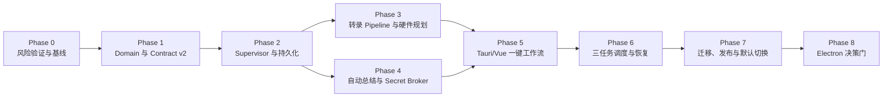

# WorkflowRuntime v2 分阶段开发计划

> 历史规划文档：当前本地 ASR 方向以 [`2026-07-12-pyannote-chunked-dual-asr-prd.md`](superpowers/specs/2026-07-12-pyannote-chunked-dual-asr-prd.md) 和对应实施计划为准。Qwen3-ASR 现在是默认后端，MOSS 为可选后端，二者均先经 Pyannote 分块；本文中关于 MOSS 默认或整段长上下文的描述仅保留作历史记录。

本文档把 [PRD](../PRD_Workflow_Runtime_V2.md)、[Domain Glossary](../CONTEXT.md) 和 [Worker Contract v2](./worker-contract-v2.md) 拆成可执行阶段。计划以保留现有 Tauri 版本可运行、主线程拥有集成改动、跨层通过 contract fixture 协作为原则。

## 1. 计划摘要

### 目标交付

1. 一个录音对应一个工作流任务。
2. 用户一次配置后自动完成转录、总结和最终 Markdown 写出。
3. MOSS 成为通过验收后的新任务默认，Legacy Qwen + pyannote 继续可选。
4. 包含模型身份、Prompt、Summary Profile 与模板的不可变任务规格。
5. 自动 CPU/GPU 运行计划。
6. 最多三个处理中任务，推理并行度按资源独立控制。
7. SQLite 工作流注册表、检查点、任务级控制、重试和恢复。
8. Tauri 首发 adapter；Electron 只在 v2 稳定后进入决策。

### 当前实施状态（2026-07-10）

- Phase 0 基线已记录在 [`docs/Phase0_Baseline.md`](./Phase0_Baseline.md)：v1 health/typecheck/Rust test 通过；当前 Python runtime 缺少 torch/transformers，MOSS 真实推理 gate 保持关闭。
- Phase 1 已建立 `contracts/workflow-v2/schemas` 与 `fixtures`、独立 Python `app.ipc.v2` codec、Rust `workflow_contract_v2` 类型、TypeScript `WorkflowRuntime` seam、纯 reducer、fake adapter 和 Pinia workflow store。
- Phase 2 骨架已建立 `app.workflow.registry`、`WorkflowSupervisor`、三槽位 scheduler、启动 interrupted recovery、artifact revision/stale 传播和 `--contract v2` stdio server；真实 Tauri client 尚未切换。
- Phase 3 的安全护栏已先落地：MOSS integrated diarization 不再经过 v1 的 30 秒切片，replacement 不再进入 ASR Prompt，任务规格记录本地模型 identity/revision/config digest/path，并新增 CPU/GPU RuntimePlan 和独立 native smoke script。
- 现有 v1 `app.ipc.protocol`、`schemas.py`、Rust lane client 和 Tauri commands 保持冻结，尚未接入生产 v2 supervisor。

### 工作量记号

| 记号 | 粗略含义 |
| --- | --- |
| S | 1–2 工程日 |
| M | 3–5 工程日 |
| L | 1–2 工程周 |
| XL | 2–3 工程周 |

该记号用于排序和拆分，不是交付承诺；MOSS 性能调优、依赖冲突和发布打包可能扩大范围。

## 2. 关键路径



Phase 3 与 Phase 4 在 Phase 2 的 fake adapter 和状态机稳定后可以并行。Phase 5 的 UI 骨架可以在 Phase 1 后使用 fake WorkflowRuntime 提前开发，但生产接线必须等待 Phase 2–4。

## 3. 开工前规则

1. 当前工作树已有 MOSS、配置、store 和 Rust command 未提交改动。开始实现前必须先由代码所有者确认如何保存这些改动；不得用 reset、checkout 或覆盖方式清理。
2. v1 contract 冻结，只修复阻断性 bug，不再添加新业务字段。
3. 新代码通过显式 feature flag 或启动参数进入 v2，不按返回内容猜测协议版本。
4. 任何阶段都不得移动、删除或提交 `models/` 权重。
5. 不递归扫描 `outputs/`；工作流历史迁移使用明确目录和索引策略。
6. 每个阶段必须满足退出标准后才能成为下一阶段的生产依赖。
7. 生产发布必须使用 Tauri build 流程，不以单独 `cargo build --release` 代替。

## 4. 建议目录演进

以下是目标结构建议，具体命名可在 Phase 1 评审时调整：

```text
contracts/
  workflow-v2/
    schemas/
    fixtures/

apps/worker-python/app/
  workflow/
    contract.py
    supervisor.py
    runtime.py
    state_machine.py
    registry.py
    scheduler.py
    artifacts.py
    secrets.py
  pipelines/
    base.py
    moss_diarize.py
    qwen_pyannote.py
    cloud_asr.py
  prompts/
    moss.py
    qwen.py
  summary/
    base.py
    openai_compatible.py
    hierarchical.py

apps/desktop-tauri/src/
  runtime/
    workflowRuntime.ts
    workflowTypes.ts
    workflowReducer.ts
    tauriWorkflowAdapter.ts
    fakeWorkflowAdapter.ts

apps/desktop-tauri/src-tauri/src/
  workflow_contract.rs
  workflow_client.rs
  workflow_commands.rs
```

旧文件在 v2 验收前继续存在；替换时采用迁移而不是叠加第二套同义状态。

## 5. Phase 0：风险验证与基线

**目标**：在大规模重构前验证最可能推翻架构的假设。

**工作量**：M–L。

### 工作项

| ID | 工作项 | 交付物 | 工作量 |
| --- | --- | --- | --- |
| P0-01 | 固化当前 v1 主流程基线 | 一组短/中/长代表性录音、预期产物和已知限制 | M |
| P0-02 | 验证官方 MOSS native Transformers 路径 | 使用锁定 revision 的最小推理脚本和依赖记录 | M |
| P0-03 | 验证 MOSS 长音频与 speaker 一致性 | 30/60/90 分钟样本报告；确认不走 Legacy 固定 30 秒分块 | M |
| P0-04 | 建立硬件基准 | CPU 与目标 GPU 的 RTF、峰值 RAM/VRAM、加载时间 | M |
| P0-05 | 验证 1/2/3 请求策略 | 单模型队列、受控 replica 或 serving PoC 的数据比较 | M |
| P0-06 | 验证依赖兼容 | Torch、Transformers、MOSS、Qwen-ASR、pyannote 组合矩阵 | M |
| P0-07 | 验证总结 context 策略 | single-pass 预算与 hierarchical 样例，禁止静默截断 | S–M |
| P0-08 | 确认产品限制 | 最大录音时长、Prompt 限制、CPU 提示、MOSS 发布默认门槛 | S |

### 推荐验证矩阵

- 录音类型：双人访谈、多人会议、噪音、混合中英文、专业术语。
- 时长：5、30、60、90 分钟。
- Prompt：无背景、仅背景、仅热词、背景 + 热词。
- 设备：CPU、BF16 GPU、仅 FP16 GPU、CUDA 不可用。
- 并发：1/2/3 个处理中任务；记录实际 ASR inference capacity。
- 输出：时间戳合法、speaker 标签稳定、无截断、转录后替换正确。

### 退出标准

1. 选定 MOSS、Torch 和 Transformers 的固定版本或 revision。
2. 明确 MOSS 与 Legacy 是否需要隔离 Python runtime。
3. 形成参考硬件下的单任务基线和三任务容量假设。
4. 确认首版是单模型队列、batch 还是 replica；没有数据时默认单模型实例、ASR capacity 1。
5. 确认 summary `auto` context 策略。
6. PRD 中待测的最大时长和发布门槛有明确数值或明确“不支持”提示。

### 阻断条件

- MOSS 在目标录音上无法维持可接受 speaker 一致性。
- MOSS 与 Legacy 依赖无法在同一环境稳定共存，且 supervisor 尚无隔离 runtime 方案。
- CPU 路径慢到无法提供可理解的产品承诺。
- 目标 GPU 无法稳定完成单任务。

## 6. Phase 1：Domain、Contract v2 与测试地基

**目标**：冻结跨层语言和最高测试 seam，确保 TypeScript、Rust、Python 不再各自发明状态。

**工作量**：L。

### 工作项

| ID | 工作项 | 交付物 | 工作量 |
| --- | --- | --- | --- |
| P1-01 | 建立 canonical JSON Schema | `contracts/workflow-v2/schemas` 中的 Envelope、Draft、Spec、Snapshot、Event、Error schemas | M |
| P1-02 | 建立 contract fixtures | `contracts/workflow-v2/fixtures` 中的请求、响应、事件和错误样本 | S–M |
| P1-03 | Python v2 codec | `app/ipc/v2`：解析、验证、未知字段、消息大小和 canonical digest 测试 | M |
| P1-04 | Rust v2 contract 类型 | `workflow_contract_v2.rs` 与 fixture 双向 serde 兼容测试 | M |
| P1-05 | TypeScript v2 类型与 runtime interface | `capabilities/previewPrompt/submit/list/get/control/retry/registerRevision/subscribe`；Catalog CRUD 独立 | M |
| P1-06 | Workflow 状态机 | 合法迁移、终态、控制意图、retry 规则 | M |
| P1-07 | fake WorkflowRuntime | `src/workflows/adapters/fakeWorkflowRuntime.ts` 与 reducer 测试使用的 adapter | M |
| P1-08 | v1 fixture 冻结 | 现有 health/run/shutdown fixture，防止迁移期回归 | S |
| P1-09 | Catalog identity schema | Profile/Template UUID、Model ID、显式 version 与 model snapshot schema | M |
| P1-10 | Catalog 迁移 fixture | 现有 Profile、模板、模型配置到稳定身份的可重复迁移样本 | M |
| P1-11 | Artifact revision contract | 不可变生成产物、derived_from、stale 和 registerRevision fixtures | M |

### 测试重点

- `request_id` 关联与 `operation_id` 跨重启幂等。
- 同一 operation ID 不同 payload 返回冲突。
- `workflow_id`、`attempt_id`、sequence 不得混用。
- 旧 attempt 的迟到事件被拒绝。
- sequence 重复与 gap 的客户端合并策略。
- secret 字段不出现在 Draft、Spec、Snapshot、Event schema。
- Draft 只含 source path，Spec 由 supervisor 生成 source fingerprint 与不可变本地模型 identity/revision/config digest/resolved path。
- 启动恢复只产生 interrupted attempt 和建议重试点，显式 retry 前不得创建 attempt。

### 退出标准

1. 三种语言对全部 fixture 解析一致。
2. 状态机测试覆盖正常路径、每阶段失败、暂停、取消、恢复和重试。
3. fake runtime 可以驱动一条完整的一键工作流 UI 测试。
4. v2 contract review 通过，后续阶段不再直接增加 UI 专用 worker 字段。
5. 稳定 catalog identity、迁移 fixture 和 artifact revision contract 在生产 adapter 开发前冻结。
6. v1 行为仍可运行。

## 7. Phase 2：Python Supervisor、注册表与恢复

**目标**：建立持久 WorkflowRuntime implementation，先用 fake 转录和 fake 总结跑通全链路。

**工作量**：XL。

### 工作项

| ID | 工作项 | 交付物 | 工作量 |
| --- | --- | --- | --- |
| P2-01 | 异步 supervisor command loop | 推理期间仍能处理 get/list/control/shutdown | L |
| P2-02 | 单 writer 事件输出 | 并发任务 JSONL 不交错 | S |
| P2-03 | SQLite registry | workflows、attempts、operations、artifacts、event sequence | L |
| P2-04 | 原子状态事务 | snapshot mutation 与 sequence/event 同事务 | M |
| P2-05 | Artifact manager | 独占任务目录、临时文件、原子 rename、digest | M |
| P2-06 | Scheduler 骨架 | 最多三个 in-flight，初始 stage capacity 可全部为 1 | M |
| P2-07 | 任务级控制 | queued cancel、运行 pause/cancel intent、expected attempt 校验 | M |
| P2-08 | Retry engine | transcription/summary/writing checkpoint 规则 | M |
| P2-09 | Startup recovery | 旧 attempt 转 interrupted、计算建议重试点，不自动创建 attempt | M |
| P2-10 | Operation idempotency store | submit/control/retry/registerRevision 跨重启去重 | M |
| P2-11 | Retention guard | 不清理仍可恢复任务的检查点 | S–M |
| P2-12 | Artifact revision registry | 不可变 revision、依赖关系、stale 传播与原子登记 | M |

### 建议 SQLite 表

```text
workflows
attempts
operations
artifacts
workflow_events
```

初期可以持久化完整 sanitized snapshot JSON，同时保留关键查询列；不要过早把每个 Prompt 字段拆成关系表。

### 退出标准

1. fake transcriber + fake summary 可以并行驱动三个工作流任务。
2. supervisor 忙于执行时仍能响应 list/get/control。
3. kill supervisor 后重启，快照、attempt、operation 和 artifact 关系保持正确。
4. 总结失败后 retry 只从 transcript checkpoint 继续。
5. 旧 attempt 模拟迟到 completion 不会覆盖新 attempt。
6. 三任务同名输出不会覆盖。
7. SQLite、manifest、事件和日志均不含 secret。
8. 启动恢复后，在用户显式 retry 前没有新 attempt、模型加载或 provider 调用。
9. 编辑 fixture 创建新 artifact revision，原检查点仍可读，转录修订使旧总结 stale。

## 8. Phase 3：转录 Pipeline、Prompt 与硬件规划

**目标**：用生产 MOSS 和 Legacy adapter 替换 fake transcriber。

**工作量**：XL。

### 工作项

| ID | 工作项 | 交付物 | 工作量 |
| --- | --- | --- | --- |
| P3-01 | `Transcriber` interface | 统一输入、进度、取消检查点和规范化 Transcript | M |
| P3-02 | MOSS adapter | 官方消息构造/生成/解析路径，长音频不走 Legacy 分块 | L |
| P3-03 | MOSS Prompt compiler | 锁定基础块、背景、热词、语言提示、digest | M |
| P3-04 | Legacy adapter | pyannote + Qwen 行为迁移并保持兼容 | L |
| P3-05 | Legacy Prompt compiler | 明确背景、术语和 replacements 的合法语义 | S–M |
| P3-06 | Cloud ASR adapter contract 封装 | 用 `auth_mode=none` 或 fake credential adapter 保持协议兼容；生产 secret smoke 延后 | M |
| P3-07 | HardwareProfiler | CPU、CUDA、内存、精度和模型 readiness | M |
| P3-08 | RuntimePlanner | auto/cpu/cuda、warmup、headroom、capacity 和 reason | L |
| P3-09 | 模型生命周期管理 | 单一 MOSS runtime、Legacy 按需加载、显式卸载策略 | L |
| P3-10 | 转录产物规范化 | transcript.md/json、时间戳和 speaker 验证 | M |
| P3-11 | MOSS 发布默认 gate | feature flag 与验收报告 | S–M |
| P3-12 | Model snapshot resolver | 稳定模型 ID、revision、配置 digest、解析路径；Legacy 含 diarization identity | M |

### 关键实现约束

1. MOSS pipeline 不得经过当前通用的固定最大 segment 切片。
2. MOSS 失败不得静默切换 Legacy，除非未来任务规格显式提供 fallback policy。
3. replacements 只在转录输出后应用。
4. `auto` 可以在转录开始前从 GPU 降级 CPU；开始产生转录后不得静默换设备拼接结果。
5. 强制 CUDA 不可用时明确失败。
6. 模型选择来自 WorkflowSpecSnapshot，不读取运行中的全局活动模型；Draft 入队后修改全局路径或默认模型不得影响任务。
7. 模型 identity/revision/config digest/resolved path 和 Prompt compiler 版本写入 workflow manifest。

### 退出标准

1. MOSS 和 Legacy 使用同一 Transcript contract 输出。
2. MOSS 代表性录音质量达到 Phase 0 确定的门槛。
3. 长音频不存在固定 30 秒分块造成的 speaker 标签重置。
4. Prompt preview 与实际提交编译结果一致。
5. RuntimePlan 与实际 device/dtype/capacity 一致。
6. CPU、GPU、模型缺失、OOM 和 source changed 均有结构化错误。
7. MOSS、Legacy production smoke 和 Cloud fake/no-auth contract smoke 通过；带真实 secret 的 Cloud production smoke 在 Phase 5 完成。

## 9. Phase 4：自动总结、长文本策略与 Secret Broker

**目标**：把独立手工总结合入 WorkflowRuntime，并确保凭据和重复计费风险受控。

**工作量**：L–XL。

### 工作项

| ID | 工作项 | 交付物 | 工作量 |
| --- | --- | --- | --- |
| P4-01 | `SummaryGenerator` interface | OpenAI-compatible 与 fake adapter | M |
| P4-02 | Summary Profile 快照 | profile UUID、endpoint、auth mode、credential ref、默认或显式覆盖模型、provider binding | M |
| P4-03 | Secret broker | credentials_required + secret.provide 临时 grant | L |
| P4-04 | single-pass 总结 | token budget 校验，禁止静默截断 | M |
| P4-05 | hierarchical 总结 | 稳定分块、局部总结、最终归并 | L |
| P4-06 | Provider retry policy | auth、rate limit、timeout、unknown result 分类 | M |
| P4-07 | Summary checkpoint | 总结结果与 final write 分离，支持 writing retry | M |
| P4-08 | 最终产物 | final-summary.md/json 与 manifest 更新 | M |
| P4-09 | 隐私审计 | 日志、DB、事件、artifact 和 crash dump 检查 | S–M |

### 默认重试语义

- 鉴权失败：不自动重试。
- 限流和临时网络错误：最多两次带抖动指数退避。
- provider 已处理但 response 丢失：标记 `SUMMARY_RESULT_UNKNOWN`，要求用户确认是否重试。
- 总结内容校验失败：保留原始诊断，允许手工重试。
- 最终文件写出失败：只重试写出，不重复调用 provider。

### 退出标准

1. 标准任务无需 UI 第二次操作即可获得最终 Markdown。
2. 长转录稿使用明确策略，不发生静默截断。
3. 总结失败后 transcript checkpoint 可打开并可只重试总结。
4. secret 仅在需要时请求，使用后或 attempt 结束后失效。
5. renderer、DB、事件、产物和普通日志中不存在 API key。
6. 失败分类和自动重试次数符合 contract。

## 10. Phase 5：Tauri Adapter 与 Vue 一键工作流

**目标**：用 v2 WorkflowRuntime 替换 lane-centric UI，保留现有编辑和预览能力。

**工作量**：XL。

### 工作项

| ID | 工作项 | 交付物 | 工作量 |
| --- | --- | --- | --- |
| P5-01 | Rust v2 supervisor client | 启动、hello、request correlation、event reader、shutdown | L |
| P5-02 | Rust workflow commands | submit/list/get/control/retry/registerRevision/capabilities/prompt preview | M |
| P5-03 | 受信任层 secret bridge | 持久版本化授权快照、endpoint binding 校验、DPAPI secret → ephemeral grant、显式撤销 | M |
| P5-04 | TypeScript WorkflowRuntime adapter | renderer 不感知 JSONL、Rust 或 Python | M |
| P5-05 | Pinia 状态重构 | draft、workflowsById、selectedWorkflowId、catalogs、artifact editors | L |
| P5-06 | 新建任务页面 | 一次填写录音、Prompt、总结和输出 | L |
| P5-07 | 任务列表 | 三任务在途、队列位置、进度和合法控制 | M |
| P5-08 | 任务详情 | timeline、快照、RuntimePlan、错误、产物和重试 | L |
| P5-09 | Artifact editor 绑定 | 按 workflow 隔离；保存创建 revision，不原地覆盖；显示 stale 关系 | M |
| P5-10 | 历史视图迁移 | workflow registry + legacy 文件浏览 | M |
| P5-11 | v1/v2 feature flag | 可回退，不允许单任务跨 adapter | S–M |
| P5-12 | 前端测试工具链 | reducer、adapter、视图和 E2E 测试 | M |
| P5-13 | Catalog 数据迁移 | 迁移 Profile/Template/Model 身份与 version；保留被 workflow 引用的 Profile 历史授权快照和 credential ref 映射 | M |
| P5-14 | 云端隐私确认 | 启动前显示 provider host、resolved model 与文本离开本机；选择配方并启动构成授权 | M |
| P5-15 | Cloud production smoke | 通过真实受信任 secret bridge 验证 cloud ASR 与 summary 的 bearer/no-auth 路径 | M |

### UI 信息架构

```text
新建任务
任务列表
任务详情
历史
设置
```

默认 MOSS 路径下隐藏实现术语；Pipeline Profile、设备 override 和 Legacy 选项放入高级设置。

### 事件恢复顺序

1. 注册 v2 event listener。
2. 启动并完成 hello。
3. 拉取非终态 workflow summaries。
4. 对已知或 sequence gap 任务 get snapshot。
5. 按 sequence upsert store。
6. 再允许用户提交和控制。

### 退出标准

1. 用户一次点击完成转录和总结。
2. 三个任务逆序完成时 UI 内容和产物不互相覆盖。
3. 旧 attempt 事件不能倒退新状态。
4. 用户控制按 workflow 执行，不能误操作资源槽中的下一任务。
5. 切换选中任务不会覆盖其他任务编辑内容。
6. 应用重载后任务列表和详情从 snapshot 恢复。
7. v1 feature flag 回退仍可运行。
8. interrupted workflow 只显示建议恢复点；用户显式 retry 前不产生新 attempt 或外部调用。
9. 编辑转录稿创建 Artifact Revision、保留原检查点并把旧总结标记 stale；选择该 revision 可以只重试总结。
10. 启动页在提交前展示 provider host 和 resolved model，并明确转录文本将离开本机。
11. renderer 无法读取 secret；错误 workflow/attempt/Profile version/purpose/credential ref/provider binding 的授权请求被拒绝，`auth_mode=none` 不请求 secret。Profile 编辑后旧任务仍按提交版本授权，显式撤销凭据后明确失败。
12. Profile/Template/Model 迁移可重复执行且身份稳定；带真实凭据的 Cloud ASR 和 summary smoke 通过。

## 11. Phase 6：三任务调度、故障注入与性能验收

**目标**：把“最多三个处理中任务”从界面能力变成经过测量的生产能力。

**工作量**：L。

### 工作项

| ID | 工作项 | 交付物 | 工作量 |
| --- | --- | --- | --- |
| P6-01 | Stage resource slots | preprocessing、ASR、summary、writing 独立容量 | M |
| P6-02 | 公平调度 | 第四任务排队、无永久饥饿、队列位置稳定 | M |
| P6-03 | 共享模型取消语义 | 安全点取消，不 kill 其他任务共用 runtime | M |
| P6-04 | 内存压力与 OOM 处理 | capacity 降级、结构化错误、其他任务继续 | M |
| P6-05 | 故障注入 | supervisor kill、provider timeout、磁盘满、source 变化 | M |
| P6-06 | 1/2/3 任务基准 | 吞吐、延迟、RAM/VRAM、UI 响应和失败率报告 | M |
| P6-07 | 长时稳定性 | 连续队列、模型复用、内存泄漏和退出清理 | M |

### 首版容量策略

```text
max_inflight_workflows = 3
preprocessing_capacity = 由 CPU/RAM 规划
asr_inference_capacity = RuntimePlan 决定，默认 1
summary_capacity = 3
writing_capacity = 由磁盘策略决定，默认 1–2
model_replicas = 默认 1
```

### 退出标准

1. 第四任务稳定排队并可取消。
2. 三任务处于不同阶段时可以真实重叠执行。
3. 任一任务失败、取消或等待 secret 不阻断其他任务。
4. 不创建未经 RuntimePlan 许可的模型副本。
5. 目标硬件上无未处理 OOM、死锁、stdout 交错或状态串单。
6. 性能报告给出“支持 CPU/GPU”和“三任务在途”的实际边界。

## 12. Phase 7：迁移、发布与默认切换

**目标**：把 v2 从开发 feature flag 提升为可安装、可回退的默认产品路径。

**工作量**：L–XL。

### 工作项

| ID | 工作项 | 交付物 | 工作量 |
| --- | --- | --- | --- |
| P7-01 | Catalog 迁移兼容清理 | 验证 Phase 5 迁移、旧 ID fallback 与 DPAPI 映射，移除仅用于开发期的兼容分支 | M |
| P7-02 | 配置迁移 | MOSS 新默认、Legacy 高级选项、旧配置兼容 | M |
| P7-03 | Legacy history | 旧 Markdown 继续可浏览，不伪造 v2 状态 | M |
| P7-04 | Runtime/路径产品化 | 应用资源、用户数据、config、outputs、models 分层 | L |
| P7-05 | Python runtime 打包 | 固定 runtime 和依赖，模型权重保持外置 | L |
| P7-06 | Tauri 生产构建 | frontend embed、installer、签名配置和启动验证 | M |
| P7-07 | 安装/升级 smoke | 无源码仓库新机器、升级、卸载、异常退出恢复 | M |
| P7-08 | 观测与诊断 | workflow/attempt/stage 日志、diagnostic ID、脱敏导出 | M |
| P7-09 | MOSS 默认 gate | 质量、性能、依赖、安全与长音频报告签字 | M |
| P7-10 | 回滚方案 | v1 adapter 与配置恢复路径，至少一个稳定发布周期 | S–M |

### MOSS 默认切换条件

1. 代表性语料质量达标。
2. 长音频 speaker 和时间戳达标。
3. CPU/GPU 基准与用户提示完成。
4. 依赖锁和 remote code 审计完成。
5. 三任务调度通过稳定性测试。
6. Legacy 仍可显式选择。

### 退出标准

1. `npm run typecheck` 和 `npm run build` 通过。
2. Rust contract/client tests 与 `cargo test` 通过。
3. Python contract、状态机、pipeline 和恢复测试通过。
4. `npm run tauri:build` 生成可安装包并在干净机器验证。
5. 安装包可定位 Python runtime、config、outputs 和外置 models。
6. v2 默认开启，v1 可显式回退。
7. 发布说明明确 MOSS、CPU/GPU、并发和云端总结隐私行为。

## 13. Phase 8：Electron 决策门

**目标**：在业务复杂性已经隐藏到 WorkflowRuntime 后，以数据决定是否替换桌面 adapter。

**工作量**：PoC M；迁移不在本计划承诺范围内。

### PoC 范围

- 复用现有 Vue 构建产物和 WorkflowRuntime TypeScript interface。
- Electron main/preload 只实现启动 supervisor、workflow methods、event bridge、文件选择和 secret store adapter。
- 不改 Python supervisor、contract v2、业务状态机和产物格式。

### 决策指标

1. 团队开发效率和调试耗时。
2. 冷启动时间和 idle RSS。
3. 安装包体积、首次安装和离线运行。
4. Python supervisor 启停和应用退出清理。
5. context isolation、sandbox、IPC allowlist 和 sender validation。
6. 现有 DPAPI 凭据迁移兼容性。
7. 自动更新、签名和发布维护成本。

未显示明确综合收益时继续 Tauri，不因已经完成 PoC 而默认迁移。

## 14. 跨阶段测试矩阵

| 测试层 | 测试 seam | 主要场景 | 首次要求阶段 |
| --- | --- | --- | --- |
| Contract | JSON fixtures | 编码、版本、必填、枚举、未知字段、secret 排除 | Phase 1 |
| State machine | WorkflowRuntime interface | 正常、失败、暂停、取消、重试、恢复 | Phase 1–2 |
| Persistence | WorkflowRuntime interface | crash、幂等、sequence、artifact 原子性 | Phase 2 |
| Artifact revisions | WorkflowRuntime interface | derived_from、stale 传播、指定 transcript revision 重试总结 | Phase 1–2 |
| Prompt | Prompt compiler interface | 背景、热词、限制、快照、digest | Phase 3 |
| Pipeline | Transcriber interface | MOSS、Legacy、Cloud、长音频、取消 | Phase 3 |
| Summary | SummaryGenerator interface | context 策略、重试、未知结果、secret | Phase 4 |
| Frontend | WorkflowRuntime fake | 多任务交错、选中切换、迟到事件 | Phase 5 |
| Desktop | Tauri adapter | 进程、IPC、DPAPI、退出清理 | Phase 5–7 |
| Concurrency | WorkflowRuntime production | 三任务、第四排队、OOM、故障隔离 | Phase 6 |
| Release | 安装包 | 干净机器、升级、模型外置、恢复 | Phase 7 |

## 15. 风险登记

| 风险 | 概率 | 影响 | 缓解 | 最晚关闭阶段 |
| --- | --- | --- | --- | --- |
| MOSS 刚发布且上游变化快 | 高 | 高 | 固定 revision、官方 helper、兼容 fixture | Phase 3 |
| MOSS 长音频 speaker 重置 | 中 | 高 | 专属 pipeline、真实长音频验收 | Phase 3 |
| Transformers/Qwen/pyannote 冲突 | 中高 | 高 | 依赖矩阵；必要时隔离 runtime | Phase 0–3 |
| 三模型副本造成 OOM | 高 | 高 | 单 supervisor、单模型、RuntimePlan | Phase 3–6 |
| CPU 模式不可接受地慢 | 中 | 中高 | 基准、耗时提示、产品门槛 | Phase 0–6 |
| Summary context 超限 | 高 | 高 | token budget、hierarchical、禁止截断 | Phase 4 |
| Summary response 丢失导致重复计费 | 中 | 中高 | provider idempotency、unknown result 状态 | Phase 4 |
| Secret 泄漏 | 中 | 高 | opaque ref、临时 grant、脱敏测试 | Phase 4–7 |
| SQLite 与产物状态不一致 | 中 | 高 | 原子事务、temp+rename、恢复协调 | Phase 2 |
| 多任务事件串单 | 中 | 高 | workflow/attempt/sequence、snapshot 权威 | Phase 1–6 |
| 当前未提交 MOSS 原型被覆盖 | 中 | 高 | 开工前保护用户改动，主线程集成 | Phase 0 |
| Electron 分散主线 | 中 | 中高 | 放到 Phase 8 决策门 | Phase 8 |

## 16. 需求追踪

| PRD 需求 | 主要阶段 |
| --- | --- |
| FR-001–005 任务与配置 | Phase 1–2、5 |
| FR-010–016 转录、Prompt 与模型快照 | Phase 0–1、3 |
| FR-020–024 硬件与运行计划 | Phase 0、3、5–6 |
| FR-030–040 总结、产物与修订 | Phase 1–2、4–5 |
| FR-050–056 并发、控制与恢复 | Phase 1–2、5–6 |
| FR-060–065 UI 与历史 | Phase 5、7 |
| FR-070–077 安全与兼容 | Phase 1、4–5、7 |

## 17. 每阶段 Definition of Done

每个阶段完成时必须满足：

1. 代码和文档使用 `CONTEXT.md` 的统一术语。
2. 新 interface 有外部行为测试，不测试实现细节。
3. TypeScript、Rust、Python contract 变更同步更新 fixtures。
4. 不新增 renderer secret 暴露。
5. 不扫描、移动或提交模型权重。
6. 相关 typecheck、build 或测试命令通过。
7. 所有新增失败模式有结构化错误和用户可理解信息。
8. 未验证能力明确标注，不以“理论支持”替代实测。
9. feature flag 和回退路径在迁移完成前保持可用。
10. 工作树中与本阶段无关的用户改动保持不变。

## 18. 建议首批实现顺序

如果立即开工，建议第一批只抓以下五项：

1. Phase 0 的 MOSS 官方路径、长音频和依赖 PoC。
2. canonical contract schemas 与 fixtures。
3. Python supervisor command loop + SQLite 最小 registry。
4. fake transcriber/summary 驱动的成功、失败、重试、恢复状态机。
5. TypeScript fake WorkflowRuntime + 多任务 reducer 测试。

这五项完成后，MOSS、总结和 UI 可以沿稳定 seam 并行推进；在此之前直接重做页面或把 lane 常量改成 3，都会产生高概率返工。
## 19. 当前代码状态审计（2026-07-10）

- Phase 0 基线与风险门已记录；本机缺少 `torch`/`transformers`，真实 MOSS 默认切换仍保持显式 gate。
- Phase 1–2 的 Contract v2、fixtures、严格 codec、SQLite registry、三槽 supervisor、幂等与 interrupted recovery 已实现。
- Phase 3–4 的 MOSS 官方 prompt/长音频 adapter、RuntimePlan、源 fingerprint、Cloud ASR adapter、summary context strategy、Secret Broker 已实现；Legacy v1 链路保持可运行。
- Phase 5 的 Tauri v2 client、后台 event reader、Pinia workflow store、一键工作流页、catalog 版本化、DPAPI native grant、timeline 与 artifact revision editor 已实现。
- Phase 6 的三并发/第四任务排队、drain、失败隔离、输出冲突、Cloud no-auth/bearer fake smoke 已覆盖；真实 MOSS/Cloud provider 与硬件长音频基准仍是发布 gate。
- Phase 7 的 `npm run tauri:build` 已生成 MSI/NSIS，release executable 已启动 smoke；v1 仍是显式兼容入口，Electron 仍等待 Phase 8 决策门。
- 2026-07-10 已在隔离 `.venv-moss313` 中完成 MOSS native CPU smoke 和 v2 production end-to-end smoke；模型 revision、依赖版本和结果记录在 [`docs/Phase0_Baseline.md`](./Phase0_Baseline.md)。30/60/90 分钟真实语料、目标 GPU 和长时三并发稳定性仍未验收。
